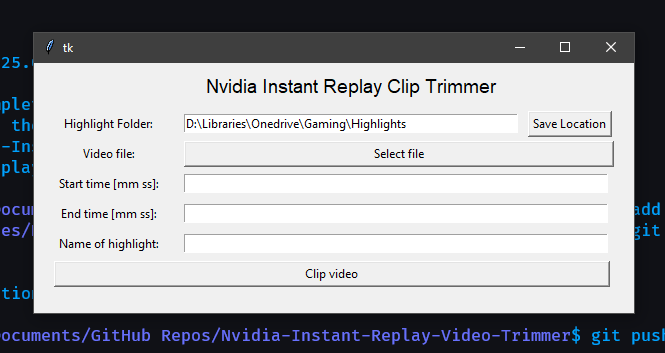

# nvidia-highlight-editor

This repository contains a basic personal project to trim videos taken using Nvidias instant replay service and save them in user-defined highlights folder. 

The program appends `_EDITED` to the end of the original clip's name to show that it is safe to delete, rather than deleting automatically incase the original file is needed. 

Build using `tkinter` & `moviepy`

